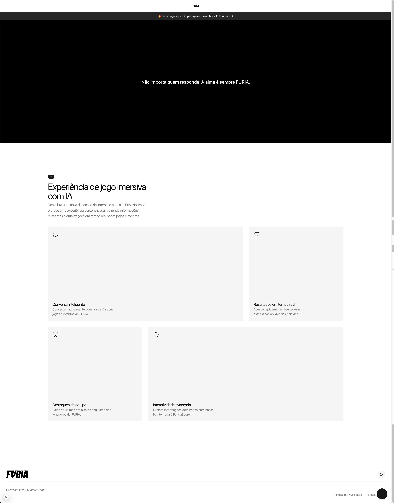
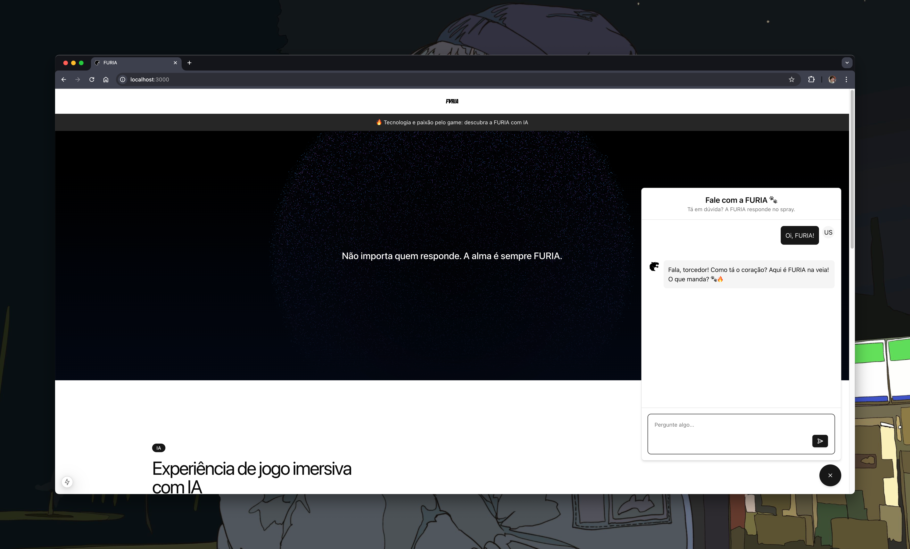
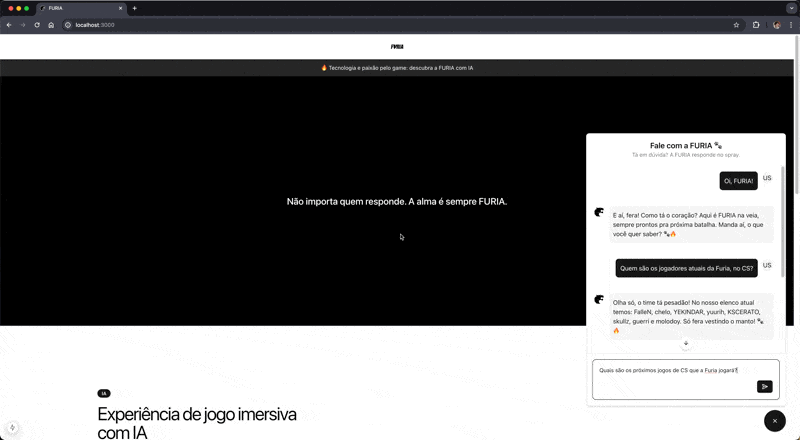

# 🦁 FURIA Challenge #1 – Experiência Conversacional

Desenvolvido como parte de um teste técnico para a FURIA, este projeto utiliza **Next.js**, **OpenAI** e **PandaScore** para implementar um chat interativo com respostas geradas por IA, permitindo que fãs acessem informações sobre a organização e o time de CS da FURIA.

## 🚀 Funcionalidades

- Chat com IA para interação com fãs
- Respostas contextuais com base na OpenAI
- Integração com a API da PandaScore para status e dados de partidas
- Interface web responsiva com Next.js

## 📺 Demonstração

👉 [Assista à apresentação no YouTube](https://www.youtube.com/seu-link-aqui)

## 🖼️ Capturas de Tela

### Landing Page



### Chat Interativo



### Demonstração do Chat em Ação



## 🛠️ Tecnologias Utilizadas

**Frontend & UI**

- [Next.js](https://nextjs.org/)
- [shadcn/ui](https://ui.shadcn.com/)

**APIs & Integrações**

- [OpenAI API](https://platform.openai.com/)
- [PandaScore API](https://developers.pandascore.co/)

**HTTP Requests**

- [Axios](https://axios-http.com/)

## 📦 Instalação

```bash
git clone https://github.com/vctorgriggi/furia-challenge-01.git
cd furia-challenge-01
npm install
```

## 🔐 Variáveis de Ambiente

Crie um arquivo `.env` na raiz do projeto e adicione as seguintes chaves:

```env
# OpenAI
OPENAI_API_KEY=your_openai_api_key

# PandaScore
PANDASCORE_API_KEY=your_pandascore_api_key
```

## ▶️ Executando o Projeto

```bash
npm run dev
```

Acesse em: [http://localhost:3000](http://localhost:3000)

## 📄 Licença

Distribuído sob a licença MIT. Consulte o arquivo LICENSE para mais informações.
